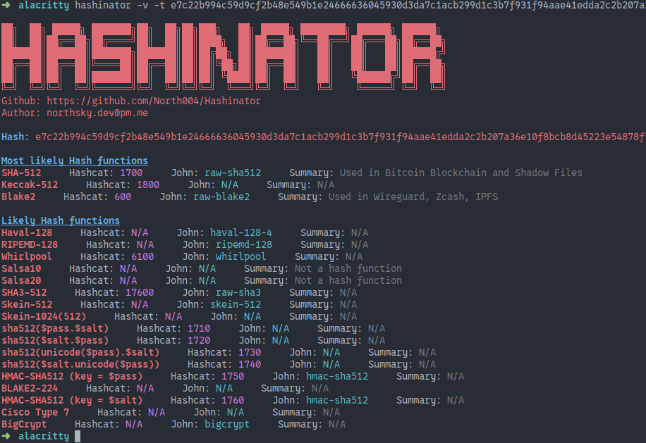

# Hashinator

🔥 The fastest hash identification tool ( i could find )

 </div>

## Table of Contents
- [About](#about)
- [Installation](#installation)
- [Usage](#usage)

## About
 * 🚀 **Blaingly Fast** - Built with the rust programming with optimizations to return matches in ~0.004 seconds allowing you to have a smooth experience with near 0 delay
 * 📚 **Informative Summary** - Popular hashes come with a description of what it is used for and where it can be found allowing you to make a more informed descion 
 * 💯 **Hash Ranknig** - Hashes are ranked by popularity allowing for the most likley hashes to appear straight away
 * ⚙️ **Built With Rust** - Built with the rust programing language, that alone should be enough


## Installation 
```
cargo install hashinator
```
## Usage
```
hashinator -t 1bc43a00ffd1a6ac361dae94f46cdc44
hashinator -f file_containing_a_hash_on_each_line.txt
hashinator -t 1bc43a00ffd1a6ac361dae94f46cdc44 -v 
```
